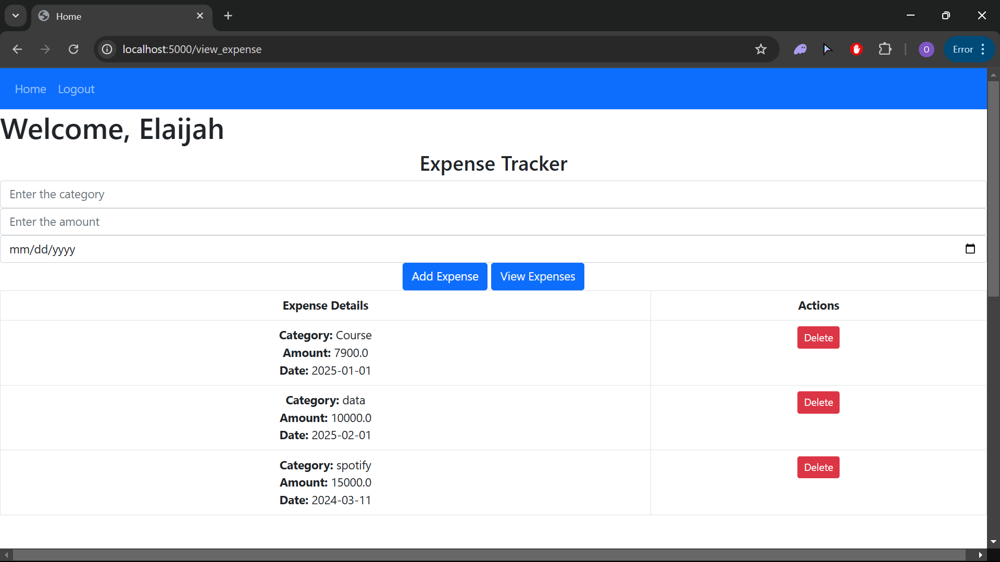
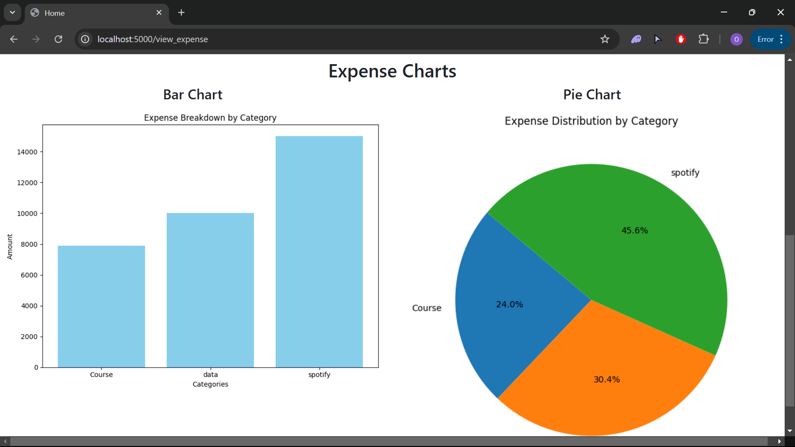

# Expense Tracker

A user-friendly web application built with Flask to manage daily expenses efficiently. The application allows users to track their expenses by category, view data in a structured table, and visualize spending patterns through charts.

## Features
- **User Authentication**: Secure registration, login, and logout functionality using hashed passwords.
- **Expense Management**:
  - Add expenses with details such as category, amount, and date.
  - View all recorded expenses in a tabular format.
  - Delete individual expenses.
- **Data Visualization**:
  - **Bar Chart**: Displays total amounts for each category.
  - **Pie Chart**: Shows the percentage breakdown of expenses by category.
- **Responsive Design**: Intuitive and easy-to-use interface.

## Technologies Used
- **Backend**: Flask
- **Database**: MongoDB
- **Data Visualization**: Matplotlib
- **Frontend**: HTML, CSS
- **Authentication**: Flask-Login and Werkzeug Security

## Installation
1. Clone this repository:
   git clone https://github.com/your-username/expense-tracker.git
2. Navigate to the project directory:
    cd expense-tracker
3. Create and activate a virtual environment:
    python -m venv env
4. Install the required dependencies:
    pip install -r requirements.txt
5. Run the application:
    python app.py

## Usage
1. Sign Up: Create a new account.
2. Log In: Access your personal dashboard.
3. Add Expenses: Record your expenses by entering the category, amount, and date.
4. View Expenses: View a summary of your expenses in a table.
5. Visualize Data: Explore your spending patterns using the bar and pie charts.
6. Manage Expenses: Delete entries as needed.

## Screenshots
Dashboard: Overview of expense management features.

## Contributions
Feel free to contribute to this project by opening issues or submitting pull requests.

## Contact
For any questions or suggestions, please email me at: oreelijah33@gmail.com